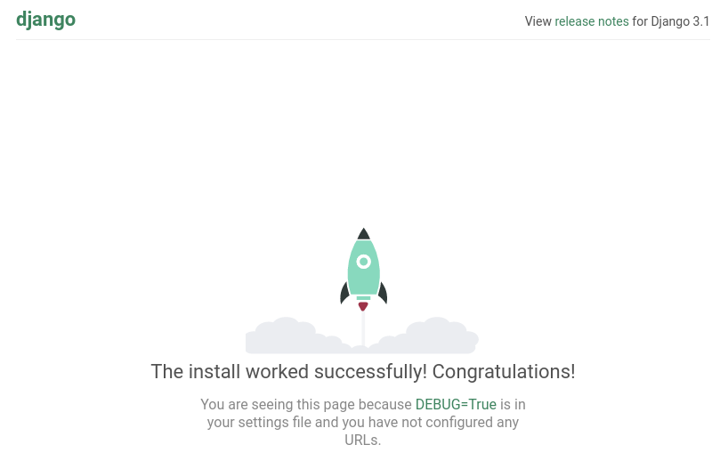

# Python Web

## Django REST

### Episodio 1: Crear estructura del proyecto

Como primer paso en el proyecto, vamos a crear un entorno virtual donde instalaremos todas las dependencias necesarias para que funcione el servidor.

Primero, instalamos el paquete o programa que permite crear entornos virtuales:

```bash
sudo apt install python3-virtualenv       # Ubuntu (Debian)
sudo pacman -S python3-virtualenv         # Manjaro (Arch)
pip3 install virtualenv virtualenvwrapper # macOS
```

Puedes agrupar todos los entornos virtuales en una carpeta común de tú sistema. Por ejemplo, yo suelo usar una carpeta llamada `.virtualenvs` dentro de la carpeta personal de los sistemas tipo Unix (Ubuntu, macOS):

```bash
mkdir -p ~/.virtualenvs
```

Con el programa instalado y la carpeta común para nuestros entornos creamos uno nuevo y vacío y lo activamos con los comandos:

```bash
virtualenv -p python3.8 python-web
source ~/.virtualenvs/python-web/bin/activate
```

El nombre del entorno virtual aparecerá a la izquierda de la línea de comandos de nuestro terminal:

```
(python-web) usuario@host:
```

En este capítulo únicamente instalaremos y ejecutaremos un entorno de [Django REST](https://www.django-rest-framework.org/) sencillo que nos devuelva la web de inicio. Para ello instalaremos únicamente el paquete de Django REST con el comando:

```bash
pip install django
pip install djangorestframework
pip install markdown       # Markdown support for the browsable API.
pip install django-filter  # Filtering support
```

Comenzamos el proyecto escribiendo:

```bash
django-admin startproject proyecto .  # ojo al '.' al final
cd proyecto
django-admin startapp aplicacion
cd ..
```

Django crea por defecto una base de datos SQLite. Es una base de datos relacional muy sencilla. Todo el contenido se encuentra en un único fichero. Por ahora es y lanzamos el servidor con los comandos:

```bash
python manage.py migrate
python manage.py runserver
```

Estos comandos nos deberían llevar a la ventana de inicio de Django como la de la imagen:

